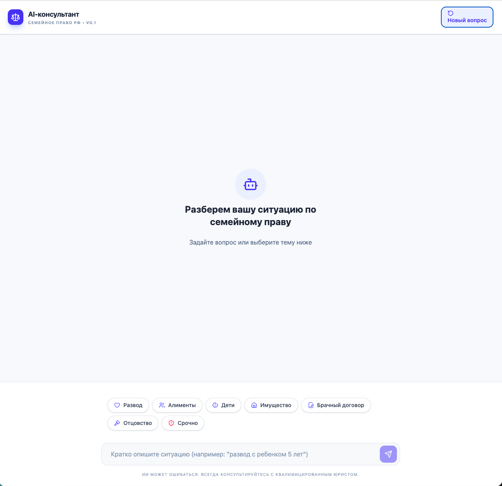
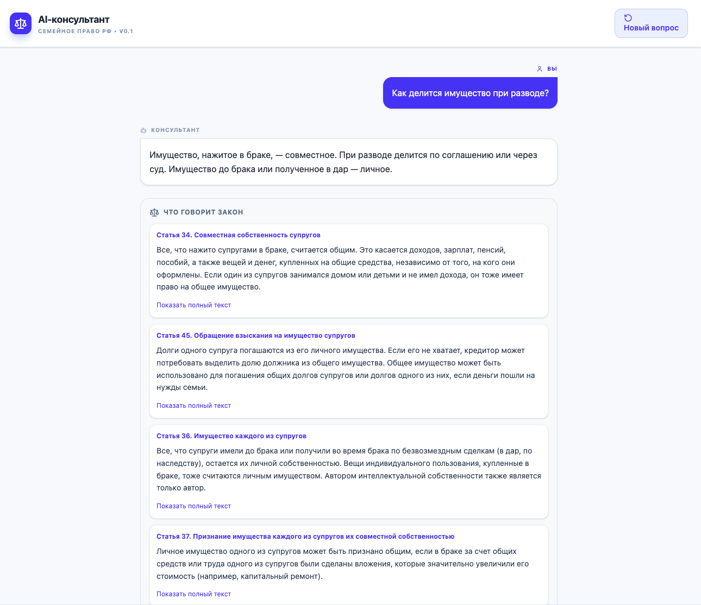
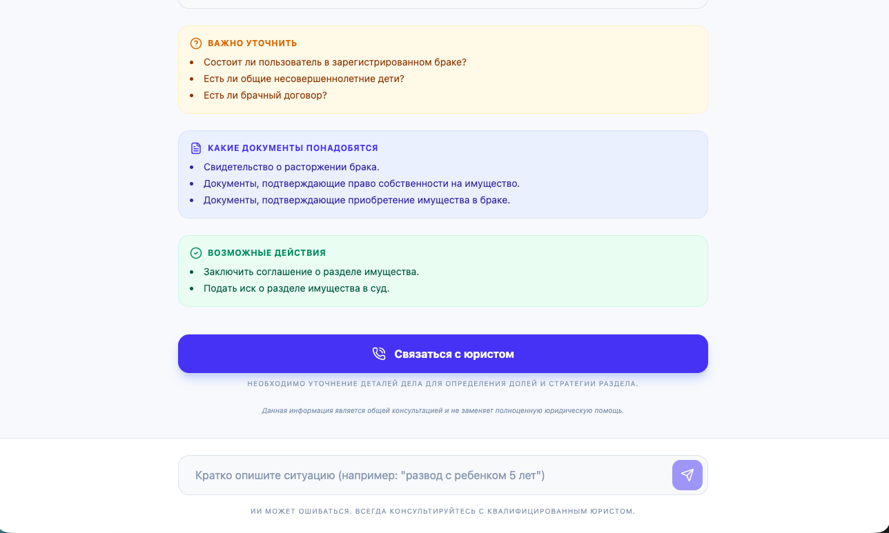

# ⚖️ AI-консультант по семейному праву РФ

## 💡 Что это

Сервис для быстрой юридической навигации по семейным вопросам.

Помогает пользователю:

* понять свою ситуацию
* увидеть применимые нормы закона
* определить дальнейшие действия

---

## 🎯 Какую проблему решает

Пользователь:

* не понимает, как работает закон
* не знает, с чего начать
* боится ошибиться

Юрист:

* тратит время на типовые вопросы
* объясняет одно и то же

---

## ⚡ Решение

Сервис превращает вопрос пользователя в:

```text
ситуация → юридическая логика → нормы → действия
```

---

## 🧠 Как работает

1. Пользователь описывает ситуацию
2. Система:

   * классифицирует запрос
   * извлекает факты
   * находит релевантные статьи (RAG)
   * формирует краткий юридический ответ
3. Пользователь получает:

* ключевой вывод
* объяснение
* нормы закона
* список действий
* риски

---

## 👥 Для кого

* пользователи без юридического образования
* юристы для ускорения консультаций
* legal-tech решения

---

## 💼 Ценность

* снижает время первичной консультации
* уменьшает нагрузку на юристов
* повышает понятность закона для пользователя

---

## 🏗 Технологии

* React + Vite (frontend)
* Node.js (backend)
* OpenRouter (LLM)
* RAG (по Семейному кодексу РФ)

---

## 🚀 Потенциал развития

* подключение базы судебной практики
* персонализированные рекомендации
* интеграция с CRM юристов
* платные консультации

---

## 📌 Статус

MVP (готов к демонстрации)

---

## ✅ DEMO

👉 https://annaartyakusheva-ai-family-law-consultant-229c.twc1.net

---

🧠 Пример

Запрос:

Хочу развестись, муж против, есть ребенок

Ответ:

👉 Если один супруг против — развод только через суд
👉 Суд может дать срок на примирение до 3 месяцев
👉 Если есть ребенок — развод только через суд

---

🖥 Интерфейс

### Главный экран


### Ответ системы



